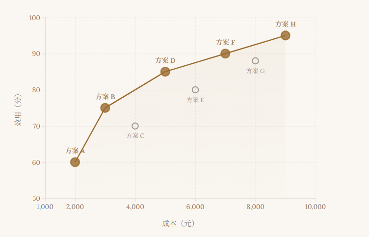
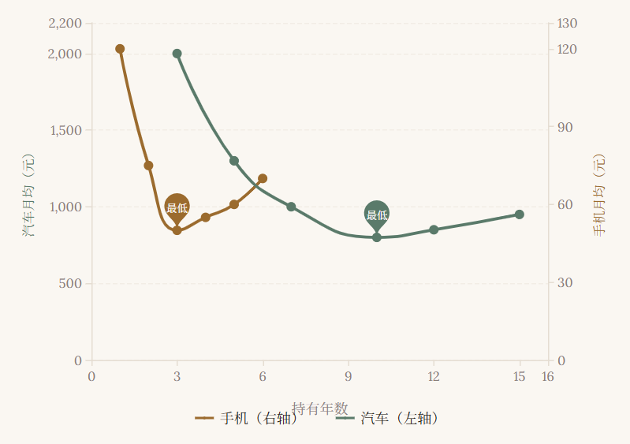
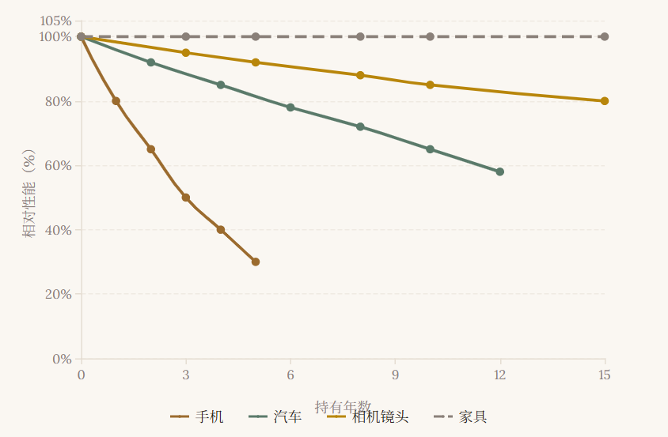

<a id="chinese"></a>

# 帕累托购买决策框架

> 🌐 **English version / 英文版：[跳转到英文版](#english)**

> 免费的可能比花钱的更贵。买便宜的比买贵的更亏。买新的，比买旧的贬值更快。
> 关于耐用品购买，你需要一套不会过时的思考工具，而不是一份三个月就失效的推荐清单。

**1. 免费的 iPhone 15 比 花钱买的 iPhone 12 更贵**

有人白送你一台 iPhone 15，现值两千九。你朋友花一千二买了台二手 iPhone 12。三年后你们同时出手。你那台——免费拿到的那台——残值九百，蒸发了两千。你朋友那台，残值两百，蒸发了一千。

谁亏得多？

白拿的那台。

**2. 买 Pro Max 比买标准版更便宜**

二手 iPhone 16 Pro Max，六千。标准版，五千九。Pro Max 只贵一百块，你犹豫了一下还是选了标准版。

两年后。Pro Max 卖四千三，标准版卖一千九。

算贬值：Pro Max 跌了一千七，标准版跌了四千。

省下的一百块，代价是两千三。

**3. 买贵的二手，比买便宜的新品便宜一千**

还是二手 iPhone 16 Pro Max，六千。全新 iPhone 17，五千五。你觉得捡到漏了，买新不买旧啊。

三年后。16PM 卖三千四，17 卖一千九。

买便宜的，贬值了 3600，买贵的，省下来 1000。

这不是文字游戏。耐用品的"价格"从来不是你付钱那一刻的数字，而是你从买入到卖出这条完整路径上的净流出。你以市场参与者的身份进场，持有一段时间，然后退出。进场时的标价只是入场券。真正决定你花了多少钱的，是退出时这个东西还值多少。

大多数人做购买决策时脑子里只有一个问题：买什么。他们比较参数、看评测、等折扣、纠结颜色，然后付钱，到此为止。但他们忽略了一件显而易见的事——你买的不是一台手机，而是一段持有期。手机会在你手里待几年，然后被卖掉、送人或塞进抽屉。起点是买入价，终点是残值，中间是你使用它的每一天。成本不是买入价，是买入价减去残值，再除以你持有的天数。

这个逻辑不只适用于手机。汽车、相机、家具、笔记本电脑，所有耐用品都遵循同一条规律。你在购买耐用品的那一刻，不是在消费，而是在进入一个有买入、持有、退出三个阶段的完整周期。消费是一次性消耗——你买一杯咖啡，喝完就没了。耐用品不同。你买入一台车，开十年，卖掉。整个过程更像一笔投资：有初始投入，有持有期间的维护费用，有退出时的回收。把耐用品当消费品来思考，是大多数购买决策出错的根源。

问题不在于你选错了型号。问题在于你用错了框架。你在用"我要买什么"的框架思考，但正确的框架是"我要进入一段什么样的持有周期"。前者只看买入价，后者看全周期成本。前者把注意力锁在参数表和评测视频上，后者逼你面对一个更难也更真实的问题：你打算用多久？退出时它还值多少？

这篇文章要做的，是把这个被忽视的框架讲清楚。不是给你一个"最佳购买清单"——那种东西三个月就过时。而是给你一套方法，一套在你下一次面对手机、汽车、相机或任何耐用品时能立刻调用的思考工具。

它叫帕累托购买决策框架。

---

## 第一章：帕累托前沿：为什么没有最优解

> "既要便宜又要好"在数学上无解。你能找到的不是唯一的最佳答案，而是一条所有合理答案排成的线。

你想要一台又便宜又好的手机。这句话听上去天经地义，但它在数学上无解。"便宜"和"好"是两个方向相反的目标。更好的性能需要更高的成本，更低的成本意味着性能妥协。你要同时在两个方向上走到极致，这在逻辑上做不到。

这不是手机的困境，是所有购买决策的困境。买车的想要动力强还省油，买相机的想要高画质还轻便，买家具的想要实木还便宜。每一个"既要又要"都是一道多目标优化题——而多目标优化没有唯一最优解。

数学家在二十世纪初就想清楚了这件事。意大利经济学家维尔弗雷多·帕累托在研究财富分配时发现了一个原理：在一个多目标系统中，不存在一个"全局最优"的方案。你能找到的最好结果，是一个"非劣解集合"——学术上叫帕累托前沿。前沿上的每一个点都满足同一个条件：不存在另一个方案同时比它更便宜又更好。

用最直白的话说：帕累托前沿上的每个方案，你都没法找到另一个方案在所有维度上同时碾压它。它可能不是最便宜的，也可能不是最强的，但它是"不可被支配"的——你改善任何一个维度，都必须牺牲另一个维度。

想象一个坐标系：横轴是成本，纵轴是效用。你把市面上所有可选方案画上去，每个点代表一个机型。有些点落在右下角——又贵又差，被其他方案"支配"，没有入选价值。有些点落在左上方——又便宜又好，但这种点极少，通常只存在于理想中。真实世界中大多数方案散落在一条从左下到右上的弧线上。这条弧线的边缘，就是帕累托前沿。

图 1：成本-效用散点图。橙色实点为帕累托前沿上的非劣方案，灰色空心点为被支配方案——存在另一个选项同时更便宜且更好。

前沿上的每个点都合理。区别只在于你更看重成本还是效用。一个三千块、效用七十分的方案，和一个七千块、效用九十分的方案，都在前沿上。前者不是"预算不够只能选便宜"，后者也不是"人傻钱多选贵的"。它们只是不同偏好下的不同选择。

这一点至关重要。传统导购文章给你的是"推荐第一名"——一台被评测者选中的手机或汽车。但那个"第一名"是怎么选出来的？评测者替你做了一个偏好判断：他决定了在成本和效用之间，你的权衡点在哪里。如果评测者偏好高性能，他的"第一名"就是最贵的那台。如果他偏好性价比，他的"第一名"可能是中端机型。无论哪种，他都在替你做一件只有你自己能做的事——判断你愿意为什么买单。

帕累托框架拒绝这样做。它不给你"第一名"。它给你前沿——三个、四个或五个非劣方案，告诉你每个方案的成本和效用，然后把偏好判断还给你。你要便宜，选前沿左端。你要性能，选前沿右端。你想要平衡，选中间。没有谁替你决定，因为没有人比你更了解你的偏好。

这个思路适用于所有耐用品品类。买相机时，帕累托前沿上的点可能是一台两千块的二手微单、一台五千块的中端无反和一台一万五的旗舰机。每一台在它自己的价位上都是非劣解——没有另一台同时比它更便宜又画质更好。买汽车时，前沿上的点可能是一台八万块的国产紧凑型、一台二十万的中型轿车和一台四十万的豪华品牌。买家具时，前沿可能是一套宜家的刨花板、一套白橡木的国产实木和一套黑胡桃的手工定制。

被支配的点——那些又贵又不够好的方案——在每一轮筛选中被淘汰。剩下的，就是你的选择集。选择集里的每一个点都值得严肃对待，因为它们各自代表了不同的偏好组合。

这也意味着，当你说"我想买最好的"时，你其实没有说清楚你的意思。"最好"在多目标世界里不是一个点，而是一条线。你必须告诉别人你在这条线上的哪个位置——你愿意用多少成本换多少效用。这个位置就是你的偏好。不表达偏好，别人就会替你表达。评测者替你表达，广告替你表达，甚至你身边的社交圈也在替你表达。

**【反过来想】**

与其问"哪个最好"，不如问"哪些可以被排除"。帕累托前沿就是这么做的——它不选最好的，它排除被支配的。当前沿上的方案摆在你面前时，真正的问题从来不是"哪个最好"，而是"我愿意在哪一个点上生活"。

---

## 第二章：持有期：被忽视的决策维度

> 你花两个小时挑型号，花零秒想用多久。但持有期是和机型同等重要的决策变量。

买一台手机时，你大概会花两个小时比较型号、看评测、查价格。但你可能花零秒思考一个问题：这台手机你打算用几年？

这不是个无关紧要的问题。持有期——你从买入到卖出的时间跨度——是和机型同等重要的决策变量。但绝大多数购买决策只考虑"买什么"，完全忽略"用多久"。结果是，人们精挑细选了一台好手机，却因为持有期选择不当，付出了远高于必要的成本。

要理解为什么持有期如此重要，需要一个公式。全文只出现这一个：

```
真实持有成本 = (买入价 − 残值 + 维修成本) ÷ 持有月数
```

买入价是你付的钱。残值是你卖出时收回的钱。维修成本是持有期间的保养、修理、换电池等支出。持有月数是你从买到卖的时间。四者相除，得到你每个月为使用这件物品实际付出的代价。

这个公式揭示了一个反直觉的事实：持有期越长，月均成本不一定越低。

短期持有的问题在于残值虽高，但分摊到每个月的金额仍然很大。一台六千块的手机用一年卖出，残值四千五，月均成本一千五除以十二，一百二十五块一个月。用两年卖出，残值三千，月均也是三千除以二十四，一百二十五。看上去一样——但加上维修成本和残值曲线的弯曲，实际情况更复杂。

长期持有的问题在于维修成本累积和残值触底。一台手机用到第四年，电池老化需要更换，屏幕可能出现划痕，接口可能接触不良。维修成本在上升。与此同时，残值已经跌到几百块，继续持有一年，残值几乎不再下降，但维修支出却在增加。月均成本开始回升。

结果是一条 U 形曲线。持有太短，月均成本高——你在为高残值付溢价。持有太长，月均成本也高——你在为累积维修买单。最低点在中间某个位置，那个位置就是最优持有期。

图 2：持有期与月均成本的关系（双纵轴）。手机（右轴）和汽车（左轴）都呈现 U 形曲线——短期持有分摊高，长期持有维修增，最优持有期在中间某处。标记点为各自最低月均成本。

用同一台手机举例。持有一年，月均一百二。持有三年，月均降到五十。持有五年，月均回升到六十——第四年换了电池，第五年修了一次充电口。三年是最低点。换成一辆车。持有三年，折旧凶猛，月均成本两千。持有十年，折旧已经摊薄，月均降到八百。持有十五年，维修频次飙升，月均回升到九百。十年是最低点。

注意两件事。第一，手机的最优持有期是三年，车的最优持有期是十年。不同品类的最优持有期差异巨大。第二，在最优持有期附近，月均成本的变化相对平缓——三年和四年的差别不大，十年和十一年的差别也不大。这意味着你不需要精确到月，只需要大致判断"我属于短期、中期还是长期持有者"。

这里有一个被忽视的杠杆：选对持有期比选对机型更能降低成本。假设你在两台手机之间纠结。一台六千，一台四千。六千那台参数更好，你为之失眠了三个晚上。但你最终买哪台，月均成本的差异可能只有二三十块。而如果你把持有期从一年改成三年，月均成本可能直接腰斩。你花三个晚上纠结型号，没花三秒钟想持有期。杠杆放在那里，你没拉。

持有期之所以被忽视，是因为它不像型号、价格那样在购买时就能比较。它是一个时间维度的变量，需要你提前规划退出策略。但正因为它被忽视，所以它是一个低竞争、高回报的决策维度。大多数人不会因为持有期做出更好的选择，因为这个维度根本不在他们的视野里。

持有期还有一层含义：它是你对自己未来使用习惯的预判。你打算三年后换机，意味着你预估三年后这台手机还能满足你的需求——或者你愿意接受到时的性能水平。这个预判不一定准确。人的需求会变，技术也在变。但正因为它不确定，才更需要被纳入决策框架，而不是被默认忽略。

一个常见的错误是：买了旗舰机却只打算用一年。旗舰机的残值在前两年下降最快——你花最多钱买了最猛烈的折旧。反过来，买一台中端机用四年，可能是更经济的组合——中端机残值下降较缓，四年的分摊拉长了，月均成本反而更低。

另一个常见错误是：买了便宜货却打算"用一辈子"。便宜的家具、便宜的电器，买入价低，但维修频次高，寿命可能反而比中端产品短。"便宜耐操"有时成立，但更多时候是错觉。一台两千块的洗衣机用五年报废，和一台四千块的用十年报废，后者的月均成本可能更低。

**【反过来想】**

与其问"买哪台"，先问"用多久"。当你知道自己是三年持有者，六千的旗舰和四千的中端之间的选择就变得清晰——不是选参数更好的那个，而是选在三年持有期下月均成本更低的那个。不要从"买什么"出发倒推"用多久"，要从"用多久"出发筛选"买什么"。

---

## 第三章：性能衰减：绝对与相对

> 你的设备没有变老，是世界变快了。性能衰减是相对的——相对于不断移动的基准线。

你的 M2 MacBook 今天能做的事，和三年前你刚买它时一样多。它打开文档的速度没变，剪辑视频的效率没变，电池续航也基本没变。从绝对意义上说，它的性能没有下降。

但你心里的满足感下降了。因为 M5 出来了。

这就是耐用品性能衰减的本质：它不是绝对下降，而是相对落后。你的设备本身没变，但世界的基准线在移动。当新机型发布、新标准确立，你的设备相对于"当前最优"的位置在下滑。你感受到的"变慢了"，很大程度上不是因为设备真的慢了，而是因为别的设备变快了。

这个区别看似微妙，但它直接决定了你该持有多久。

想象一条向右上方倾斜的曲线——横轴是时间，纵轴是该品类的性能基准（最新款的水平）。这条线的斜率，就是这个品类的代际增长率。我把它记作 r。r 越大，基准线上升越快，你手中的设备相对落后得越快。

图 3：不同品类的相对性能衰减。手机（r 高）三年落后一半，汽车（r 低）十年仍有七成，相机镜头衰减极缓，家具几乎不衰减。

不同品类的 r 差异巨大。手机的 r 很高——每年新一代芯片、新摄像头传感器、新屏幕技术，基准线快速上移。一台旗舰手机在三年后，相对性能可能只剩当初的六成。它的绝对性能没变，但世界往前走了，它被甩在了后面。

汽车的 r 低得多。一台车的发动机效率、底盘调校、安全配置，年与年之间的代际提升有限。十年前的车和今天的车，核心驾驶体验的差异远小于三年前的手机和今天的手机。一台车持有了十年，相对性能的下降是平缓的。它还能跑，还安全，只是少了些新功能。

相机镜头的 r 极低。光学技术的进步以十年为单位——一枚十年前设计的镜头，今天的成像素质依然出色。甚至有些老镜头因为独特的光学特性，在二手市场不降反升。r 接近零的品类，长持有期的效用衰减极慢。

家具的 r 几乎为零。一张实木桌子不会因为新桌子上市而"变差"。它的承重、稳定性、美观不随时间下降——保养得当，甚至可能因为木材老化而更有质感。家具的持有成本几乎只由残值和维修决定，与性能衰减无关。

r 是连接"持有期"和"效用"的隐藏变量。上一章讨论了持有期对成本的影响，这一章看到：持有期不仅影响成本，还影响效用。持有越久，设备相对于基准线越落后，你从中获得的效用越低。最优持有期是成本和效用共同决定的那一点——不是成本最低点，而是成本和效用的综合最优点。

r 高的品类，效用衰减快，最优持有期短。手机的 r 高，所以三年左右换一次可能是合理的——不是因为手机"坏了"，而是因为三年后它相对最新基准已经显著落后，继续持有的边际效用太低。

r 低的品类，效用衰减慢，最优持有期长。汽车的 r 低，所以持有十年可能比三年更经济——十年后性能相对落后不多，而成本的分摊优势明显。相机镜头的 r 更低，持有二十年也不荒谬。

r 接近零的品类，持有期可以无限长。家具、手工工具、高品质的机械表，这些品类的性能几乎不随代际更替而衰减。你买它们，基本是"一次性投入，长期使用"，不需要考虑换代周期。

这里需要诚实地标注边界。上述衰减模型基于一个假设：代际增长率 r 在未来保持稳定。但 r 不是常数。技术突破会突然抬高 r——智能手机在 2007 年 iPhone 发布后的几年里 r 飙升，当时持有旧手机的效用衰减极快。技术成熟会让 r 下降——今天的个人电脑，代际提升已经放缓，r 比十年前低得多。

这意味着基于历史 r 值预测未来持有期的置信度有限。短期持有（一到三年）的预测相对可靠，因为 r 在短期内大幅变化的概率低。长期持有（五年以上）的预测置信度低——你可能低估了 r 的变化，导致实际效用衰减比预期更快或更慢。使用这个框架时，把长期预测当作方向性参考而非精确计算。

还有一点：r 只衡量"技术代际"的衰减。但有些购买决策涉及非技术维度的效用。一台老相机拍出的照片，画质可能不如新相机，但它有"复古感"——这是 r 无法捕捉的效用。一辆老车加速不如新车，但它有"机械感"。这些主观效用在框架之外，但在决策之中。框架帮你算清技术衰减这笔账，剩下的主观偏好，还是你自己决定。

**【反过来想】**

与其问"这台设备能用多久"，不如问"这个品类的基准线走得多快"。不要盯着你手中的设备看它变没变旧，要盯着整个品类的基准线看它跑得多快。你的设备没有变老，是世界变快了。

---

## 尾声：决策是偏好表达

> 所有"最优购买决策工具"都在替你做偏好判断。这个框架不——它给你前沿，不给你答案。

市面上每一个"最优购买决策工具"——无论是评测网站的推荐榜单、AI 导购助手，还是朋友圈的口碑排行——本质上都在做同一件事：替你做偏好判断。

帕累托购买决策框架拒绝替你做这个判断。它给你前沿——所有非劣方案的集合——然后把选择权交还给你。你看着前沿上的三四个方案，它们各自代表不同的成本-效用组合。选哪个？框架不回答这个问题。它只确保你选的每一个都在前沿上，而不是在前沿之下。

消费主义文化不断传递一个信息：你买什么，你就是什么人。开什么车代表你的阶层，用什么手机代表你的品味，穿什么品牌代表你的身份。在这个叙事里，购买行为被赋予了超出物品本身的意义——它成了身份认同的工具。于是"买什么"变成一个关于"我是谁"的声明。

这个叙事的问题不在于它赋予了购买行为意义，而在于它把偏好的表达权外包了。当你因为"别人都买这个"而买一台手机，你不是在表达自己的偏好，而是在复制别人的偏好。当你因为"评测说这个最好"而选一台相机，你是在接受评测者的偏好替代你自己的。你的购买行为表达了别人的偏好，唯独没有表达你自己的。

帕累托框架要做的，是把偏好表达的权利拿回来。它要求你先承认一件事：你已经有偏好了。你不是一张白纸，不是到了商店才开始思考自己想要什么。你对成本敏感还是对性能敏感，你看重当下体验还是长期价值，你追求技术前沿还是情感满足——这些偏好早已存在，只是从未被系统地纳入购买决策。

框架的作用，是用数据帮你找到符合偏好的非劣解。你的偏好是低成本？看前沿左端。你的偏好是高性能？看前沿右端。你的偏好是长持有期？看哪个方案在长持有期下的月均成本最低。你的偏好是不折腾？看哪个品类的 r 值低，长持有期不落伍。

框架不改变你的偏好，它尊重你的偏好。它做的事是确保你的偏好被准确翻译成购买行为——不被评测者的偏好覆盖，不被广告的情绪引导扭曲，不被社交压力推向前沿之外的方案。

这里有一个重要的区分：表达偏好不等于满足欲望。欲望是"我想要那个最贵的"，偏好是"在成本和效用的权衡中，我更看重效用"。欲望往往被外部刺激激发——广告、社交、稀缺感。偏好从内在价值判断中生长出来——你对生活质量的理解，对金钱边际效用的感知，对时间价值的评估。帕累托框架服务的是偏好，不是欲望。

这也解释了为什么框架刻意避免给出"推荐"。"推荐"隐含了一个判断：有一个比其他都好的选择。但在帕累托前沿上，没有谁比谁更好——只有谁更符合你的偏好。推荐一出现，偏好判断就被外包了。框架宁可把三个方案摆在你面前让你自己选，也不愿替你选一个然后告诉你这是"最佳"。

最终，每一个购买决策都是一次自我认知的练习。你在前沿上的哪个点，取决于你对自己的了解有多深。你知道自己用手机用几年会腻吗？你知道自己愿意为更好的驾驶体验每月多付多少吗？你知道自己对相机画质的敏感度，是否值得为它多花五千块？这些问题没有标准答案，只有你的答案。而你的答案，就是你在前沿上选的那个点。

<a id="english"></a>

# The Pareto Purchase Decision Framework

> 🌐 **中文版 / Chinese：[返回中文版](#chinese)**

> The free one can cost you more than the paid one. The cheap one can cost you more than the expensive one. The new one loses value faster than the old one.
> What you need for durable-goods purchases is a thinking tool that does not expire — not a recommendation list that goes stale in three months.

**1. A free iPhone 15 can cost more than a paid-for iPhone 12.**

Someone hands you an iPhone 15, worth ¥2,900 today. Your friend pays ¥1,200 for a used iPhone 12. Three years pass. You both sell. Yours — the free one — fetches ¥900. You have lost ¥2,000. Your friend's fetches ¥200. He has lost ¥1,000.

Who lost more?

The one who got it for free.

**2. The Pro Max can be cheaper than the standard model.**

A used iPhone 16 Pro Max costs ¥6,000. The standard model costs ¥5,900. The Pro Max is only ¥100 more. You hesitate, then pick the standard.

Two years later. The Pro Max sells for ¥4,300. The standard sells for ¥1,900.

Count the depreciation. The Pro Max lost ¥1,700. The standard lost ¥4,000.

The ¥100 you saved cost you ¥2,300.

**3. An expensive used phone can be ¥1,000 cheaper than a cheap new one.**

Same used iPhone 16 Pro Max, ¥6,000. A brand-new iPhone 17, ¥5,500. You feel you have found a bargain. Newer is better, right?

Three years later. The 16 Pro Max sells for ¥3,400. The 17 sells for ¥1,900.

The "cheap" one depreciated ¥3,600. The "expensive" one saved you ¥1,000.

This is not wordplay. The "price" of a durable good is never the number on the receipt at the moment of purchase. It is the net outflow along the entire path from buying to selling. You enter as a market participant, hold for a while, then exit. The sticker price at entry is just the admission ticket. What actually decides how much you paid is how much the thing is still worth when you exit.

When most people make a purchase, only one question runs through their head: *what* to buy. They compare specs, read reviews, wait for discounts, agonize over color, then pay — and stop there. But they have overlooked something obvious. You are not buying a phone. You are buying a holding period. The phone will sit with you for a few years, then be sold, given away, or shoved into a drawer. The start is the purchase price. The end is the residual value. In between is every day you use it. Cost is not the purchase price. Cost is the purchase price minus the residual value, divided by the number of days you held it.

This logic does not apply only to phones. Cars. Cameras. Furniture. Laptops. Every durable good follows the same rule. The moment you buy a durable, you are not consuming. You are entering a complete cycle with three phases: buy, hold, exit. Consumption is one-shot — you buy a coffee, drink it, it is gone. Durables are different. You buy a car, drive it for ten years, sell it. The whole thing is closer to an investment: an initial outlay, holding-period maintenance, a recovery at exit. Thinking about durables as if they were consumables is the root of most bad purchase decisions.

The problem is not that you picked the wrong model. The problem is that you used the wrong frame. You are thinking in the frame of "what do I buy." The right frame is "what holding cycle am I entering." The former looks only at the purchase price. The latter looks at full-cycle cost. The former locks your attention on spec sheets and review videos. The latter forces you to face a harder, truer question: how long will you use it, and what will it be worth when you exit?

What this essay does is lay out that neglected frame. Not to hand you a "best-buy list" — those go stale in three months. To hand you a method. A thinking tool you can reach for the next time you face a phone, a car, a camera, or any durable good.

It is called the Pareto Purchase Decision Framework.

---

## Chapter 1 — The Frontier: Why There Is No Best

> "Both cheap and good" is mathematically unsolvable. What you can find is not a single best answer, but a line of all the reasonable ones.

You want a phone that is both cheap and good. It sounds obvious. It is mathematically unsolvable. "Cheap" and "good" point in opposite directions. Better performance costs more. Lower cost means compromise. You cannot push both to their limits at once. It cannot be done.

This is not a phone problem. It is the dilemma of every purchase. Car buyers want power and fuel economy. Camera buyers want image quality and portability. Furniture buyers want solid wood and a low price. Every "I want both" is a multi-objective optimization problem. And multi-objective optimization has no single optimal solution.

Mathematicians settled this in the early twentieth century. The Italian economist Vilfredo Pareto, studying wealth distribution, found a principle. In a multi-objective system, no "globally optimal" option exists. The best you can find is a set of "non-inferior solutions" — what academics call the Pareto frontier. Every point on the frontier satisfies the same condition: no other option is simultaneously cheaper *and* better.

In plain terms: for every option on the frontier, you cannot find another that beats it on every dimension at once. It may not be the cheapest. It may not be the most powerful. But it is "non-dominated" — improve any dimension and you must sacrifice another.

Picture a coordinate system. The x-axis is cost. The y-axis is utility. Plot every available option, each point a model. Some points fall in the lower right — expensive and weak, "dominated" by other options, with no value. Some fall in the upper left — cheap and good — but these are rare, usually existing only in theory. In the real world, most options scatter along an arc from lower-left to upper-right. The edge of that arc is the Pareto frontier.

Figure 1: Cost–utility scatter plot. Solid orange dots are the non-inferior options on the Pareto frontier; hollow gray dots are dominated — for each, another option exists that is simultaneously cheaper and better.

Every point on the frontier is reasonable. The only difference is whether you weight cost or utility more. A ¥3,000 option at 70 utility, and a ¥7,000 option at 90 utility, are both on the frontier. The former is not "settling for cheap because the budget is tight." The latter is not "foolishly paying for the expensive one." They are simply different choices under different preferences.

This matters. Traditional buyer's guides hand you a "No. 1 recommendation" — a phone or car chosen by the reviewer. But how was that "No. 1" picked? The reviewer made a preference judgment for you. They decided where your trade-off between cost and utility lies. If the reviewer favors performance, their "No. 1" is the most expensive. If they favor value for money, their "No. 1" may be a mid-range model. Either way, they are doing something only you can do — deciding what you are willing to pay for.

The Pareto framework refuses to do this. It does not give you a "No. 1." It gives you the frontier — three, four, or five non-inferior options, with their cost and utility — and hands the preference judgment back to you. Want cheap? Take the left end of the frontier. Want performance? Take the right end. Want balance? Take the middle. No one decides for you, because no one knows your preferences better than you.

This idea applies to every durable category. For cameras, the frontier may be a ¥2,000 used mirrorless, a ¥5,000 mid-range body, and a ¥15,000 flagship — each non-inferior at its price, with no other option simultaneously cheaper and better. For cars, the frontier may be an ¥80,000 domestic compact, a ¥200,000 mid-size sedan, and a ¥400,000 luxury marque. For furniture, the frontier may be an IKEA particleboard set, a Chinese-made solid white oak set, and a handcrafted black walnut set.

Dominated points — the ones that are expensive yet not good enough — get eliminated at each round of screening. What remains is your choice set. Every point in that set deserves to be taken seriously, because each represents a different mix of preferences.

It also means that when you say "I want the best," you have not actually said anything clear. In a multi-objective world, "best" is not a point. It is a line. You must tell others where on that line you sit — how much cost you will trade for how much utility. That position is your preference. If you do not express it, others will express it for you. Reviewers will. Ads will. Even your social circle will.

**[Think in reverse]**

Rather than asking "which is best," ask "which can be ruled out." That is what the Pareto frontier does. It does not pick the best. It eliminates the dominated. When the options on the frontier are in front of you, the real question is never "which is best." It is "which point am I willing to live on."

---

## Chapter 2 — Holding Period: The Missing Variable

> You spend two hours picking the model and zero seconds thinking about how long you will use it. But the holding period is a decision variable just as important as the model.

When you buy a phone, you probably spend two hours comparing models, reading reviews, checking prices. You may spend zero seconds on one question: how many years do you plan to use this phone?

This is not a trivial question. The holding period — the span from purchase to sale — is a decision variable just as important as the model. Yet most purchase decisions consider only "what to buy" and completely ignore "how long to use it." The result: people carefully pick a good phone, and because they chose the wrong holding period, they pay far more than necessary.

To see why the holding period matters so much, one formula is needed. It is the only one in this essay:

```
True holding cost = (Purchase price − Residual value + Maintenance cost) ÷ Holding months
```

The purchase price is what you paid. The residual value is what you get back when you sell. The maintenance cost is what you spend over the holding period on upkeep, repairs, and battery swaps. The holding months is the time from purchase to sale. Divide, and you get what using this item actually costs you per month.

This formula reveals a counterintuitive fact: a longer holding period does not necessarily mean a lower monthly cost.

The problem with short holding is that even though the residual value is high, the amount spread over each month is still large. A ¥6,000 phone sold after one year, with a ¥4,500 residual, means a ¥1,500 loss spread over twelve months — ¥125 a month. Sold after two years, with a ¥3,000 residual, the loss is ¥3,000 over twenty-four months — also ¥125. They look the same. But add maintenance costs and the curvature of the depreciation curve, and reality is more complex.

The problem with long holding is accumulating maintenance and a residual value that has hit the floor. By the fourth year, the battery is aging and needs replacement. The screen may be scratched. The port may be flaky. Maintenance costs are rising. At the same time, the residual value has dropped to a few hundred yuan. Hold another year, the residual barely moves, but maintenance keeps growing. The monthly cost starts to climb.

The result is a U-shaped curve. Hold too short and the monthly cost is high — you are paying a premium for high residual value. Hold too long and the monthly cost is also high — you are paying for accumulated maintenance. The minimum is somewhere in the middle. That point is the optimal holding period.

Figure 2: Holding period vs. monthly cost (dual y-axes). Both phones (right axis) and cars (left axis) show U-shaped curves — short holding means high amortization, long holding means rising maintenance; the optimal holding period lies somewhere in between. The marked points are each one's minimum monthly cost.

Take the same phone. Held one year, ¥120 a month. Held three years, ¥50. Held five years, ¥60 again — a battery swap in year four, a charging-port repair in year five. Three years is the minimum. Now take a car. Held three years, depreciation is brutal, ¥2,000 a month. Held ten years, depreciation has been amortized, ¥800. Held fifteen years, maintenance soars, ¥900. Ten years is the minimum.

Two things to notice. First, the phone's optimal holding period is three years; the car's is ten years. Optimal holding periods differ dramatically across categories. Second, near the optimum, the monthly cost curve is relatively flat — three vs. four years makes little difference; ten vs. eleven years makes little difference. You do not need to be accurate to the month. You only need a rough sense of "am I a short-, medium-, or long-term holder?"

Here is a neglected lever: picking the right holding period reduces cost more than picking the right model. Suppose you are torn between two phones — one ¥6,000, one ¥4,000. The ¥6,000 one has better specs, and you lose three nights of sleep over it. But the difference in monthly cost between the two may be only ¥20 or ¥30. Change the holding period from one year to three, and the monthly cost may be cut in half. You spent three nights on the model and three seconds on the holding period. The lever was right there. You did not pull it.

The holding period is neglected because, unlike model or price, it cannot be compared at the moment of purchase. It is a variable on the time dimension. It requires you to plan an exit strategy in advance. But precisely because it is neglected, it is a low-competition, high-return decision dimension. Most people do not make better choices through holding period, because the dimension is not in their field of view at all.

The holding period has another layer of meaning. It is your prediction of your own future usage. Planning to replace in three years means you estimate that in three years this phone will still meet your needs — or that you will accept the performance level it then offers. This prediction may not be accurate. Needs change. Technology changes. But precisely because it is uncertain, it must be brought into the decision framework rather than ignored by default.

A common mistake: buying a flagship but planning to use it for only a year. A flagship's residual value falls fastest in the first two years. You pay the most money to buy the steepest depreciation. Conversely, a mid-range phone held for four years may be the more economical combination — mid-range residuals decline more gently, and the four-year amortization stretches out, so the monthly cost is actually lower.

Another common mistake: buying cheap and planning to "use it forever." Cheap furniture, cheap appliances — low purchase price, but high maintenance frequency, and the lifespan may actually be shorter than mid-range products. "Cheap and durable" is sometimes true. More often it is an illusion. A ¥2,000 washing machine that dies in five years vs. a ¥4,000 one that dies in ten — the latter's monthly cost may well be lower.

**[Think in reverse]**

Rather than asking "which to buy," first ask "how long to use." Once you know you are a three-year holder, the choice between a ¥6,000 flagship and a ¥4,000 mid-range becomes clear — not the one with better specs, but the one with the lower monthly cost over a three-year holding period. Do not start from "what to buy" and back out "how long to use." Start from "how long to use" and filter "what to buy."

---

## Chapter 3 — Decay: Absolute vs. Relative

> Your device has not aged. The world has gotten faster. Performance decay is relative — relative to a baseline that keeps moving.

Your M2 MacBook today can do exactly what it could the day you bought it three years ago. It opens documents just as fast. It edits video just as efficiently. Battery life is about the same. In absolute terms, its performance has not declined.

But your satisfaction has dropped. Because the M5 came out.

This is the essence of durable-goods performance decay. It is not an absolute decline. It is a relative falling-behind. Your device itself has not changed. But the world's baseline is moving. As new models are released and new standards set, your device's position relative to "current best" slides. The "slowness" you feel is largely not because the device has actually slowed. It is because other devices have gotten faster.

This distinction looks subtle. It is not. It directly determines how long you should hold.

Picture an upward-sloping curve. The x-axis is time. The y-axis is the performance baseline of the category — the level of the latest model. The slope of this line is the category's per-generation growth rate. I denote it r. The larger r is, the faster the baseline rises, and the faster your device falls behind.

Figure 3: Relative performance decay across categories. Phones (high r) fall behind by half in three years; cars (low r) still retain 70% after ten years; camera lenses decay extremely slowly; furniture barely decays at all.

The r values differ dramatically across categories. Phones have a high r. Every year brings a new chip, a new image sensor, a new display technology, and the baseline jumps fast. A flagship phone three years on may have only 60% of its original relative performance. Its absolute performance is unchanged. But the world has moved on and left it behind.

Cars have a much lower r. Engine efficiency, chassis tuning, safety features — year-over-year generational gains are modest. The difference in core driving experience between a ten-year-old car and today's car is far smaller than between a three-year-old phone and today's phone. A car held for ten years sees a gentle decline in relative performance. It still drives. It is still safe. It just lacks some new features.

Camera lenses have an extremely low r. Optical technology advances on the scale of decades. A lens designed ten years ago still produces excellent images today. Some old lenses even appreciate on the used market, thanks to unique optical character. For categories with r near zero, utility decays extremely slowly over long holding periods.

Furniture's r is essentially zero. A solid-wood table does not "get worse" because a new table came out. Its load-bearing capacity, stability, and aesthetics do not decline with time. With proper care, it may even gain character as the wood ages. The holding cost of furniture is determined almost entirely by residual value and maintenance, not by performance decay.

r is the hidden variable connecting "holding period" and "utility." The previous chapter showed that the holding period affects cost. This chapter shows it also affects utility. The longer you hold, the further the device falls behind the baseline, and the less utility you get from it. The optimal holding period is the point jointly determined by cost and utility — not the cost minimum, but the combined optimum of cost and utility.

For categories with high r, utility decays fast and the optimal holding period is short. Phones have a high r. Replacing around every three years may be reasonable — not because the phone "broke," but because after three years it is significantly behind the latest baseline, and the marginal utility of continuing to hold is too low.

For categories with low r, utility decays slowly and the optimal holding period is long. Cars have a low r. Holding ten years may be more economical than three — after ten years, performance has fallen behind only modestly, while the cost-amortization advantage is clear. Camera lenses have an even lower r. Holding one for twenty years is not absurd.

For categories with r near zero, the holding period can be indefinitely long. Furniture. Hand tools. High-quality mechanical watches. Performance in these categories barely decays across generations. Buying them is basically "one-time investment, long-term use." No need to think about replacement cycles.

Here is where I have to be honest. The decay model above rests on an assumption: that the generational growth rate r remains stable in the future. But r is not a constant. Technological breakthroughs can suddenly raise r — in the years after the iPhone's launch in 2007, r for smartphones soared, and the utility of holding an old phone decayed extremely fast. Technological maturity can lower r — today's personal computers have seen generational gains slow, and r is much lower than a decade ago.

This means predictions of future holding periods based on historical r have limited confidence. Short-term predictions — one to three years — are relatively reliable, because r is unlikely to change sharply in the short term. Long-term predictions — five years and up — have low confidence. You may underestimate a shift in r, causing actual utility decay to be faster or slower than expected. When using this framework, treat long-term predictions as directional guidance rather than precise calculation.

One more thing. r measures only "technological-generational" decay. But some purchase decisions involve utility on non-technical dimensions. An old camera may produce lower-image-quality photos than a new one, but it has "retro character" — a utility r cannot capture. An old car may not accelerate like a new one, but it has "mechanical feel." These subjective utilities lie outside the framework but matter to the decision. The framework helps you account for technological decay. The rest of your subjective preferences are still up to you.

**[Think in reverse]**

Rather than asking "how long can this device keep going," ask "how fast is this category's baseline moving." Do not stare at the device in your hand wondering whether it has aged. Stare at the category's baseline and see how fast it is running. Your device has not aged. The world has gotten faster.

---

## Epilogue — Decisions Are the Expression of Preference

> Every "optimal purchase decision tool" makes the preference judgment for you. This framework does not. It gives you the frontier, not the answer.

Every "optimal purchase decision tool" on the market — whether a review site's recommended list, an AI shopping assistant, or a rankings post from your social circle — is doing the same thing. It is making the preference judgment for you.

The Pareto Purchase Decision Framework refuses to make that judgment for you. It gives you the frontier — the set of all non-inferior options — and hands the choice back to you. You look at three or four options on the frontier, each representing a different cost-utility mix. Which one? The framework does not answer. It only ensures that every option you choose is on the frontier, not below it.

Consumerist culture keeps transmitting one message: you are what you buy. The car you drive signals your class. The phone you use signals your taste. The brands you wear signal your identity. In this narrative, the act of purchase is loaded with meaning beyond the object itself — it becomes a tool for identity. So "what to buy" becomes a statement about "who I am."

The problem with this narrative is not that it gives purchase meaning. It is that it outsources the right to express your preferences. When you buy a phone because "everyone else buys this one," you are not expressing your own preference. You are copying others'. When you choose a camera because "the review says this is best," you are letting the reviewer's preference substitute for your own. Your purchase expresses everyone's preferences except your own.

What the Pareto framework does is take back the right to express your preferences. It asks you to first admit one thing: you already have preferences. You are not a blank slate. You are not someone who only starts thinking about what they want once they reach the store. Whether you are sensitive to cost or to performance, whether you value immediate experience or long-term value, whether you chase the technological frontier or emotional satisfaction — these preferences already exist. They have just never been systematically incorporated into your purchase decisions.

The framework's role is to use data to help you find the non-inferior options that fit your preferences. Prefer low cost? Look at the left end of the frontier. Prefer high performance? Look at the right end. Prefer long holding periods? Look for the option with the lowest monthly cost under long holding. Prefer low hassle? Look at categories with low r, where long holding does not leave you behind.

The framework does not change your preferences. It respects them. What it does is ensure that your preferences are accurately translated into purchasing behavior — not overwritten by the reviewer's preferences, not distorted by the emotional pull of ads, not pushed by social pressure toward options off the frontier.

Here is an important distinction. Expressing preference is not the same as satisfying desire. Desire is "I want the most expensive one." Preference is "in the trade-off between cost and utility, I weight utility more." Desire is usually triggered by external stimuli — ads, social pressure, scarcity. Preference grows from internal value judgments — your understanding of quality of life, your perception of money's marginal utility, your assessment of time's value. The Pareto framework serves preference, not desire.

This also explains why the framework deliberately avoids giving "recommendations." A "recommendation" implies a judgment: that one choice is better than the others. But on the Pareto frontier, no one is better than anyone else — only more or less aligned with your preferences. The moment a recommendation appears, the preference judgment has been outsourced. The framework would rather lay three options in front of you and let you choose than pick one for you and call it "best."

Ultimately, every purchase decision is an exercise in self-knowledge. Where on the frontier you land depends on how well you know yourself. Do you know how many years it takes before you get tired of a phone? Do you know how much more per month you would pay for a better driving experience? Do you know whether your sensitivity to camera image quality is worth an extra ¥5,000? These questions have no standard answers. Only your answers. And your answers are the point you pick on the frontier.
